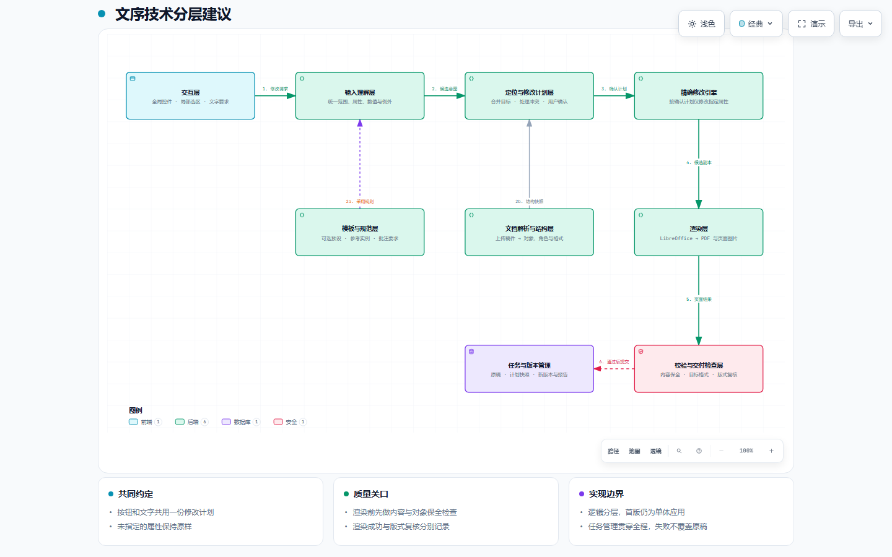

# 文序产品与技术文档

本文档集面向产品、研发与验收人员，明确文序从 POC 走向真实文档格式调整工具的目标。基线日期为 2026-09-21。

**产品目标：让用户通过全局按钮或局部要求，准确调整已经写好的 Word 文档，只改变明确指定的位置和属性。**

| 阅读顺序 | 文档 | 回答的问题 |
| --- | --- | --- |
| 1 | [产品目标与需求定位](PRODUCT.md) | 为谁解决什么问题，哪些能力属于本阶段，如何判断可用 |
| 2 | [v0.6 需求基线](REQUIREMENTS.md) | 全局与局部如何操作，冲突如何处理，具体按哪些用例验收 |
| 3 | [整体架构与分层能力](ARCHITECTURE.md) | 八个业务模块如何协作，数据契约是什么，当前代码还缺什么 |
| 4 | [架构图、图源与验证说明](diagrams/README.md) | 如何查看交互图、编辑图源和核对验证证据 |

## 文档状态与使用规则

- **v0.5 是当前 POC 的实现基线**：运行方式和已支持范围见 [仓库 README](../README.md)，历史验证见 [VERIFICATION.md](../VERIFICATION.md)，原开发约束见 [TASK.md](../TASK.md) 和 [PLAN.md](../PLAN.md)。
- **v0.6 是目标需求与设计基线**：包含用户已明确的产品方向，以及据此制定的交互默认行为、架构建议和验收标准；不表示新功能已经实现。
- 开始后续开发时，以本目录定义的全局/局部编辑语义为目标，同时使用现状能力表安排增量实现；不得把设计图当成已完成清单。
- 新验收编号统一为 `V06-A01` 至 `V06-A14`，与 v0.5 PRD 的旧编号分开。
- 实现新增能力时，同步更新需求状态、架构中的现状映射和验收证据。仅修改文档、渲染成功或合成用例通过，都不能作为真实文档兼容性完成的证明。

当前能力检查基于提交 [`677a0a581f0c`](https://github.com/GZUCMHjy/wenxu-docx/tree/677a0a581f0c1a46a2b5d33fda385f7a8bf72a43)。文档中未附真实稿件、微信附件、转换副本或实际内容截图。
